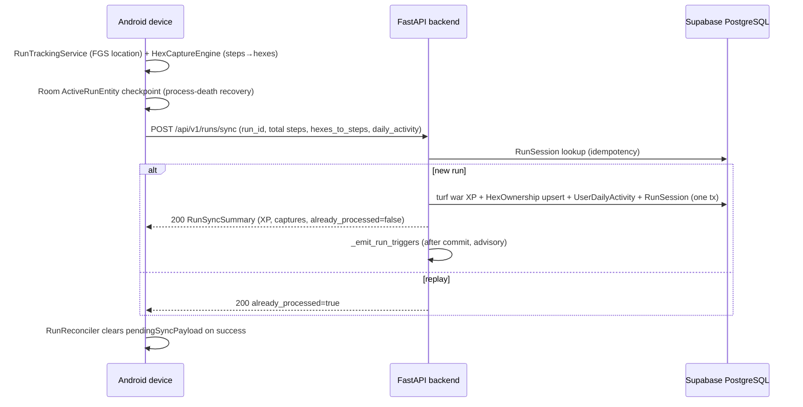
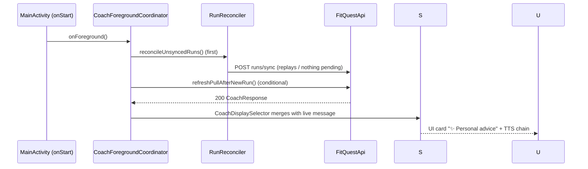
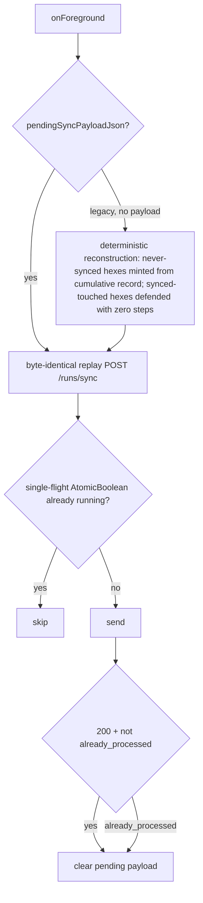

# FitQuest — Software Requirements Specification and As-Built Technical System Report

**Document type:** As-Built SRS (documents the system that exists today, not what was planned)
**As-of date:** 2026-09-07 (post M9.4 — Final Presentation Polish & Demo Readiness)
**Primary source of truth:** The repository itself (Kotlin/Compose Android app + FastAPI backend + Supabase PostgreSQL). Older design papers are historical context only.

> **Reading rules for this document.**
> - "Not verified from current repository" = could not be confirmed from code/tests at time of writing.
> - "Deferred / Not Implemented" = deliberately not built (auth, production deployment, etc.).
> - Blockchain, Web3, NFT, IPFS, XGBoost, Kafka, and similar early-paper ideas are **not** part of the current system. They appear only in §23 (Deferred).
> - API keys, tokens, and connection strings are shown as placeholders (`<MAPTILER_API_KEY>`, `<DATABASE_URL>`, `<AI_PROVIDER_KEY>`).

---

## 1. Introduction

### 1.1 Purpose
This document specifies FitQuest as it is actually built after milestones M1–M9: a territory-capture gamified fitness system consisting of an Android client (Kotlin, Jetpack Compose, MapLibre, Room) and a FastAPI backend (SQLModel, Alembic, Supabase PostgreSQL, pgvector RAG, Gemini LLM) that turns real-world walking/running into hexagonal territory control (Uber H3), with a grounded AI coach delivered by pull (HTTP) and push (WebSocket) and spoken via native Android TTS.

### 1.2 Scope
- In scope: every component verifiable in this repository — capture engine, run sync/idempotency, territory/turf-war rules, trigger engine, WebSocket coaching transport, PushCoach, AI coach pipeline (context → rules → embedding → retrieval → LLM → validation → caching), native TTS chain, offline reconcile, leaderboard, map viewport API, quests, Room persistence, tests, configuration.
- Out of scope (not built): production authentication, production deployment, blockchain/Web3 features (see §23).

### 1.3 Product Overview
FitQuest ("capture territory by walking"): the world map is partitioned into Uber H3 hexagons (resolution 10, ≈65 m edge). While on a run, a user's device-counted steps within each hex are tallied; on run completion the device syncs the run to the backend, which is authoritative for XP, hex ownership, defense scores, the leaderboard, and daily activity. A trigger engine fires coaching events (run completed, territory captured, step milestone), which fan out over WebSocket to the device; the backend generates a RAG-grounded, rules-aware LLM coaching message and pushes it live; the Android app speaks it with native TextToSpeech.

### 1.4 Definitions
| Term | Meaning (as implemented) |
|---|---|
| H3 cell | Uber H3 hexagon; resolution 10, grid ring k=2 (~19 hexes visible) |
| King | Owner of a hex (`HexOwnership.king_id`) |
| Defense score | Steps the king had when capturing/reinforcing (`defense_score_steps`) |
| Turf war | XP rules for capture (+50), reinforce (+10), steal (+100) — §8 |
| Run ledger | `RunSession` table used for run-id idempotency/replay |
| Coach fingerprint | sha256 of canonical `FitnessContext` JSON, version `fix-e-v1` |
| RAG | Retrieval-augmented generation over a 7-document public-health corpus via pgvector |

### 1.5 Intended Audience
Maintainers, reviewers, and evaluators of the as-built system (project submission / research alignment).

---

## 2. Overall Description

### 2.1 System Context (Diagram E)
```
[Android device]  --HTTPS (Retrofit)-->  [FastAPI backend]  --SQL(pooler)-->  [Supabase PostgreSQL]
       |                                     |      |--HTTPS--> [Gemini embedding + LLM / AgentRouter]
       |--WebSocket /api/v1/ws/coaching <----|      |
       |                                     +--rag chunk embeddings (pgvector, 1536-d)
       +--HTTPS tiles--> [MapTiler / OpenFreeMap fallback]
```
- Backend runs locally (uvicorn on the demo laptop). No production deployment exists (§22).
- Device reaches backend over LAN (`BACKEND_BASE_URL`, default `http://10.0.2.2:8000/` for emulator).
- Supabase is reached via the transaction pooler (`DATABASE_URL`) — direct `db.*.supabase.co` is unreachable from this machine (IPv6), per project environment notes.

### 2.2 User Classes
Single class today: a local **dev user** (`DEV_USER_ID = 00000000-0000-0000-0000-000000000001`) injected by a dev stub in `apps/api/app/api/dependencies.py` (`get_current_user`, with a `TODO(production)` JWT note). Real multi-user auth is **Deferred / Not Implemented** (§23). Seeded demo players exist in the database for leaderboard/map realism.

### 2.3 Operating Environment
- Android: minSdk 24, target/compileSdk 36, physical Samsung device verified (emulators lack a step-counter sensor).
- Backend: Python venv at `apps/api/.venv`, uvicorn; 22 backend test files; 391 tests passing at M9.3 baseline (2026-09-07) — historical evidence from `docs/agent_ledger.md`; not re-run in M9.4 because no backend code changed.
- Android tests: 153 `@Test` methods across 23 test files — re-run in M9.4, all passing; `assembleDebug` BUILD SUCCESSFUL.

---

## 3. System Architecture (As Built)

### 3.1 Component Inventory
**Backend (`apps/api/app/`):**
`main.py` (FastAPI app, CORS allow-all, `/health`), `api/router.py` (mounts users/map/runs/quests/leaderboard/recommendations/rag/coach + ws/coaching), `api/dependencies.py` (dev-user stub), `core/config.py` (Settings), `core/database.py` (engine, `pool_pre_ping=True`), and modules: `runs`, `map`, `users`, `quests`, `leaderboard`, `recommendations`, `rag`, `coach`, `triggers`.

**Android (`apps/app/fitquest/src/main/java/com/example/mobileapp/`):** 73 Kotlin files across `core/` (capture, sensors, geo, network, run, tts, data/local, telemetry, permissions, model), `di/` (Koin), `features/` (capture, home, leaderboard, profile, quests), `ui/`.

### 3.2 Diagram A — Run & Sync Data Flow


### 3.3 Diagram B — Live Coaching Push Chain
```mermaid
flowchart LR
    A[run sync commits] --> T[TriggerEngine]
    T -->|subscribe| W[CoachingSessionManager WS fan-out]
    T -->|subscribe| P[PushCoach coalesce+cooldown]
    P --> C[build_fitness_context]
    C --> R[recommend R1-R5]
    C --> E[Gemini embedding 1536d]
    E --> G[retrieve_chunks pgvector]
    C --> L[LLM Gemini / AgentRouter]
    G --> L
    L --> V[validate <=4000 chars]
    V --> S[(CoachCache LRU 200 users)]
    V --> W
    W -->|coaching_message| D[Android CoachingWsClient]
    D --> S2[LiveCoachStore]
    S2 --> X[CoachDisplaySelector freshness]
    S2 --> Y[CoachingSpeechController drop(1)]
    Y --> Z[CoachingSpeechGate dedupe] --> N[AndroidTtsSynthesizer QUEUE_FLUSH]
```

### 3.4 Diagram C — Pull Path (M8.5)


### 3.5 Diagram D — Offline Reconcile (RunReconciler)

Byte-identical replay of stored `pendingSyncPayloadJson`; for legacy runs recorded without a payload, deterministic reconstruction as shown. Single-flight via `AtomicBoolean`.

### 3.6 Key Non-Functional Decisions in Code
- All AI/network calls have 30 s timeouts; failures degrade to pull card / "unavailable" state — never crash the run flow.
- WS sessions use a 256-message queue with drop-on-full backpressure (never blocks the sender).
- Trigger emission after DB commit, wrapped in try/except (advisory — coaching can never fail a run sync).

---

## 4. Functional Requirements — Territory & Capture

### 4.1 Hex Grid
- Uber H3 resolution 10 (`HexCaptureEngine.h3Resolution = 10`), edge ≈65 m.
- Nearby grid: `gridDisk` ring size 2 → ~19 hexes visible.
- H3 native libs bundled at `fitquest/src/main/jniLibs/` (arm64-v8a, armeabi-v7a only — x86 emulators unsupported).

### 4.2 Capture Engine (`core/capture/HexCaptureEngine.kt`)
- Combines location updates + step-counter deltas into per-hex step tallies (`hexesToSteps`).
- M9.2 fixes (present, uncommitted in working tree at time of writing): `pendingStepsBeforeHex` buffering so steps accumulated before the first GPS fix are credited once a hex is known; `applyStepDelta`/`applyLocationUpdate` exactly-once accounting; `startLocationMonitoring` re-arm on run start.
- Location permission crashes (M9.2): `LocationTrackingManager` catches `SecurityException`/`RuntimeException` from `requestLocationUpdates` best-effort.

### 4.3 Run Lifecycle
- `RunTrackingService`: foreground service (type `location`), notification id 1001, channel `fitquest_run_active`, `ACTION_START_RUN`/`ACTION_STOP_RUN`.
- Process-death recovery: `ActiveRunEntity` Room checkpoint (paused state, accumulated session steps, hexes JSON, last checkpoint time); `ActiveRunStatusResolver` classifies LIVE / RECOVERABLE / NONE; CaptureScreen offers pending-recovery prompt on resume.
- Provisional client XP while offline: `(hexes × 50) + (steps ÷ 100 × 10) + 20`; server XP is authoritative on successful sync (`already_processed` re-reconciles).

---

## 5. Backend Data Model (As Built)

All tables created by Alembic migrations `0001_initial_schema`, `0002_user_daily_activity`, `0003_rag_knowledge_base` (pgvector `CREATE EXTENSION IF NOT EXISTS vector`, HNSW cosine index, dimension frozen at 1536).

| Table | Key fields |
|---|---|
| `user` | id UUID PK, username unique, avatar_url, total_lifetime_steps, total_hexes_captured, current_streak, longest_streak, last_activity_date |
| `hexownership` | hex_id str PK, king_id FK→user.id (indexed), defense_score_steps, captured_at, times_stolen |
| `runsession` | id str PK, user_id indexed, started_at (run-id replay ledger) |
| `capturedhex` | autoincrement id, run_id, hex_id |
| `userdailyactivity` | PK (user_id, activity_date), steps, active_minutes, optional goal_steps/hexes/defense, updated_at |
| `quest` / `userquest` | quests (title, reward_xp, active_date); user progress (current_progress, is_completed, composite PK) |
| `friendship` | PK (requester_id, addressee_id), status pending/accepted/blocked |
| `ragdocument` / `ragchunk` | chunk text + embedding vector(1536) (PG) / text (SQLite); UniqueConstraint(document_id, chunk_index) |

Room (device), version 5 with migrations 2→3, 3→4, 4→5: hex ownership record, run/session history, `ActiveRunEntity` checkpoint, pending-sync payload.

---

## 6. External Interface Requirements — REST API

Base: `/api/v1`. All verified in routers; auth is the dev-user stub (§2.2).

| Endpoint | Behavior |
|---|---|
| `GET /health` | `{"status":"ok"}` |
| `POST /runs/sync` | Body `RunSyncPayload` (total_session_steps, hexes_to_steps, daily_activity?, run_id?). Run-id idempotency; replay → `already_processed=true`. Fresh run: turf-war XP, hex upserts, `UserDailyActivity` upsert (prior steps read for milestones), RunSession insert — one transaction. IntegrityError on race → already_processed. |
| `GET /map/viewport` | bbox honored at zoom ≥14; antimeridian (min_lng > max_lng) handled |
| `GET /map/{hex_id}` | 404 if unknown |
| `GET /map/user/{user_id}` | user's hexes |
| `POST /map` | capture/reinforce → 201; conflict → 409 |
| `PATCH /map` | defense update |
| `GET /leaderboard` | metric "hexes"; all real users ranked (0-hex included); competition ranking (ties share), alphabetical tiebreak; top-N + current_user_entry if missed cut |
| `GET /recommendations` | FitnessContext + R1–R5 recommendation (§10) |
| `POST /rag/retrieve` | top-k grounded chunks (threshold 0.50, k=4) |
| `GET /rag/documents` | ingested corpus listing |
| `GET /coach` | full coaching pipeline (§12); errors: NotConfigured→503, Timeout→504, provider/validation→502 |
| `WS /api/v1/ws/coaching` | per-user fan-out (§11) |
| Users | `POST /users` (201), `GET /users`, `GET /users/{user_id}`, `PATCH /users/{user_id}` |
| Quests | `POST /quests` (201), `GET /quests`, `GET /quests/{quest_id}`, `GET /quests/{user_id}/quests`, `POST /quests/{user_id}/quests/{quest_id}` enroll (201, 409 if enrolled), `PATCH /quests/{user_id}/quests/{quest_id}` progress update |

No RAG ingestion endpoint exists by design (auth deferred — corpus ingestion is a backend-side operation).

Android consumes 5 of these via Retrofit (`core/network/FitQuestApi.kt`): `POST runs/sync`, `GET leaderboard`, `GET map/viewport`, `GET recommendations`, `GET coach`.

---

## 7. Business Rules — Turf War & XP (As Implemented in `runs/service.py`)

| Event | Rule |
|---|---|
| Capture unclaimed hex | +50 XP; king = user; defense_score = run steps in hex |
| Reinforce own hex | +10 XP; defense_score increases |
| Steal rival hex | If run steps in hex > defense_score_steps: +100 XP, king changes, defense resets to winner's steps, `times_stolen += 1` |

Daily activity: upsert on (user_id, device-local `activity_date`) with client-plausible range validation (schemas.py). Client daily snapshot: `goal_completed = steps >= goalSteps` (DailyActivitySnapshotBuilder).

---

## 8. Run Sync, Idempotency & Offline Reconcile

- **Server idempotency:** `run_id` (client UUID) is the replay key; `RunSession` is the ledger. Duplicate/raced syncs return the same summary with `already_processed=true`; the DB constraint race is caught as IntegrityError → already_processed.
- **Device reconcile (`core/network/RunReconciler.kt`):** single-flight; replays the exact stored payload (`pendingSyncPayloadJson`, byte-identical); for pre-payload legacy runs, deterministic reconstruction. On success the pending payload is cleared — the ledger guard makes retries safe.
- **Pre-GPS buffering (M9.2):** steps counted before the first GPS fix are buffered and credited when a hex is resolved (§4.2).
- **Ordering:** foreground reconcile happens **before** the coach pull refresh (CoachForegroundCoordinator) so a just-synced run can trigger a fresh coach fetch.

---

## 9. Trigger Engine (M8.1)

`apps/api/app/modules/triggers/engine.py` — in-process, thread-safe singleton `trigger_engine`.

- **Trigger types (exhaustive — no others implemented):** `WORKOUT_COMPLETED`, `TERRITORY_CAPTURED`, `ACTIVITY_MILESTONE`. The module docstring explicitly states WORKOUT_STARTED / STREAK_MILESTONE / QUEST_PROGRESS are NOT implemented.
- **Milestones:** 5,000 / 10,000 / 15,000 / 20,000 daily steps; only the highest crossed threshold emits.
- **Cooldowns (default):** WORKOUT_COMPLETED 10 s; TERRITORY_CAPTURED 0 s; ACTIVITY_MILESTONE 0 s.
- **Dedupe:** LRU, capacity 100,000. Accepted-log size 250.
- **Emission:** after run-sync commit, advisory (`try/except`); subscribers: `CoachingSessionManager` and `PushCoach` (both subscribe at import).

---

## 10. Recommendations & FitnessContext

`recommendations/service.py` — `build_fitness_context()` produces:

`user_id, total_lifetime_steps, hexes_owned, recent_captures_7d, last_capture_at, total_defense_steps, activity_date, steps_today, active_minutes_today, goal_steps, goal_completed_today, goal_progress_ratio`

(sources: User aggregates, HexOwnership aggregates, latest UserDailyActivity row; `recent_captures_7d` over RECENT_CAPTURE_WINDOW_DAYS = 7).

`recommend()` — exactly five rules, priority order:

| # | Condition | Output |
|---|---|---|
| R1 COLD_START | no captures | STARTER, 1000 steps, easy |
| R2 LAPSED_PLAYER | last capture > 2 days (LAPSED_AFTER_DAYS=2) | RECOVERY, 2000 steps, easy |
| R3 TERRITORY_AT_RISK | 1 hex owned | DEFENSE, 1 hex, medium |
| R4 CONSISTENT_PERFORMER | ≥3 captures in 7 days (CONSISTENT_CAPTURES_7D=3) | PROGRESS, 3 hexes, hard |
| R5 MAINTAIN | otherwise | MAINTAIN, 3000 steps, medium |

---

## 11. WebSocket Transport (M8.2)

`apps/api/app/modules/triggers/ws.py` — endpoint `WS /api/v1/ws/coaching`.

- Envelope type `coaching_trigger`; message type `coaching_message` (only this type carries a coach payload).
- Per-user fan-out via `CoachingSessionManager.has_live_sessions / send_to_user`; one sender-loop + client-watcher task per session; thread-safe sends via `call_soon_threadsafe`.
- Backpressure: 256-message queue per session; drop-on-full (sender never blocks).
- User resolution: missing → dev user; valid UUID → that user.
- **Android client (`core/network/CoachingWsClient.kt`):** backoff 1 s → ×2 → 30 s cap, max 5 attempts; only `coaching_message` frames are parsed into CoachResponse and published; `coaching_trigger` / unknown / malformed frames ignored; idempotent connect/disconnect; connected on `MainActivity.onStart`, disconnected on `onStop`.

---

## 12. AI Coach Pipeline (M8.3 + M8.5)

`coach/service.py generate_coaching()` — 8 steps: build context → recommend (R1–R5) → embed query → retrieve chunks → build grounded prompt → call LLM → validate (≤4000 chars, else `CoachValidationError`) → return `CoachResponse`; only validated responses are cached.

- **Retrieval:** pgvector cosine (`<=>` in SQL on PostgreSQL; portable Python cosine under SQLite), similarity threshold **0.50** applied before top-k = **4**.
- **Embeddings:** `gemini-embedding-001`, outputDimensionality **1536**, via `batchEmbedContents` REST (`GEMINI_API_BASE = https://generativelanguage.googleapis.com/v1beta`, key header `x-goog-api-key`). Placeholder: `<AI_PROVIDER_KEY>`.
- **LLM providers (`coach/llm.py`):** `GeminiLLMProvider` (model `gemini-2.5-flash`, temperature 0.4, maxOutputTokens 1024, thinkingBudget 0) or `AgentRouterLLMProvider` (model `deepseek-v4-flash`, max_tokens 4096, User-Agent `claude-cli/1.0.0 (external, cli)` — required by that gateway). Selection: `LLM_PROVIDER` = `gemini` | `agentrouter`. Error types: LLMProviderError/Timeout/NotConfigured, MalformedLLMResponse.
- **Prompt (`coach/prompt.py`):** three sections; 6 rules (ground in retrieved knowledge; no invented facts; no medical advice; conservative when knowledge is limited; 2–4 sentences; plain text); fallback instructions add rule 7; `_MAX_CHUNK_CHARS` 1600; supports event context phrasing ("completed a run", "captured new territory", "reached a daily step milestone").
- **`CoachResponse` fields:** `generated_at, message, grounded, context, recommendation, retrieval, context_fingerprint, cached`.

**Caching:**
- Backend `CoachCache` (`coach/cache.py`): fingerprint = sha256 of canonical FitnessContext JSON, version `fix-e-v1`; LRU, max 200 users; `cached=true` on hit.
- PushCoach push-dedupe key: `"push:" + sha256(PUSH_KEY_VERSION "m83a-push-v1", user_id, fingerprint, reasons)`.

**PushCoach (`coach/push.py`, M8.3A):** armed-flag coalescing; 30 s cooldown (configurable `push_coach_enabled/cooldown/workers`, default 2 workers); skips generation when no live WS session; failures contained (never propagate to the run path); builds fresh context at generation time; describe-event phrases feed the prompt.

**M8.5 Freshness (`core/network/CoachDisplaySelector.kt`, minSdk 24 — string-based comparison, no java.time):** no live message → pull; pull not Success → live; same fingerprint → keep live; different fingerprint → strictly newer `generated_at` (lexicographic, canonical format) wins; indeterminate → live.

**Android pull cache (`core/network/CoachCache.kt`):** keyed by synced-run-id signature, single-flight, failures never auto-retried.

---

## 13. RAG Knowledge Base (As Built)

- Corpus: 7 `CorpusDocument` entries of WHO/CDC public-health guidance (`rag/corpus.py`).
- Chunking: deterministic, paragraph-first, `CHUNK_SIZE` 1200 chars, `CHUNK_OVERLAP` 150, word-boundary overlap (`rag/chunking.py`).
- Ingestion: `ingest_document`, idempotent on (source, title); embeddings 1536-d.
- No public ingestion endpoint (auth deferred). Retrieval exposed via `POST /rag/retrieve`.
- Store: pgvector `vector(1536)` + HNSW cosine index on PostgreSQL; text fallback for SQLite (tests).
- Evaluation tools (manual, never in pytest): `apps/api/tools/evaluate_retrieval.py`, `evaluate_live_coach.py`, `synthetic_fitness/`.

---

## 14. Native TTS (M8.4)

Diagram F — TTS chain:
```mermaid
flowchart LR
    A[CoachingWsClient] --> B[LiveCoachStore]
    B --> C[CoachingSpeechController drop(1) latest-wins]
    C --> D[CoachingSpeechGate dedupe fingerprint+text]
    D --> E[AndroidTtsSynthesizer QUEUE_FLUSH fq-coach-N]
```

Chain: `CoachingWsClient` → `LiveCoachStore` → `CoachingSpeechController` (`drop(1)`, latest-wins pending, enabled seam, idempotent release, started from `FitQuestApp`) → `CoachingSpeechGate` (dedupe on context_fingerprint + normalized text) → `AndroidTtsSynthesizer` (Android `TextToSpeech`, `QUEUE_FLUSH`, utterance ids `fq-coach-N`).

Properties verified in code: duplicate suppression (gate), latest-message behavior (drop(1) + QUEUE_FLUSH), graceful failure (TTS init/synthesis errors swallowed — coaching never crashes), process-scoped lifecycle (controller released with the process; no service binding). Verified on device in M9.4: `utterance done id=fq-coach-1`.

---

## 15. Android Client Architecture

- **Pattern:** Orbit MVI for feature screen models (e.g., `CaptureScreenModel`); Koin DI (`di/AppModule.kt`); Jetpack Compose + Material 3 UI; MapLibre Native map.
- **Navigation/screens:** Home (level/streak, Today's Activity, Daily Operations, Territory card, Daily Quests, Recent Expeditions, coach cards), Capture/Run (map + hex grid + HUD), Rank (leaderboard), Profile/Trophies (achievements, XP), plus map layer.
- **Map:** MapLibre + MapTiler (`MAPTILER_API_KEY` / `MAPTILER_STYLE_URL` buildConfigFields); keyless OpenFreeMap Liberty style fallback (`https://tiles.openfreemap.org/styles/liberty`) when the key is absent/dead.
- **Permissions (`core/permissions/PermissionManager.kt`):** ACCESS_FINE_LOCATION, ACCESS_COARSE_LOCATION, ACTIVITY_RECOGNITION, POST_NOTIFICATIONS.
- **Sensors:** `LocationTrackingManager` (GPS), step-counter sensor manager; dev simulators removed (M9.4 README correction — `DevLocationSimulator`/`DevStepSimulator` no longer wired).
- **Persistence:** Room v5 (§5); repository for hex data and run history.
- **Build:** minSdk 24, target/compileSdk 36, versionName 1.0; `BACKEND_BASE_URL` default `http://10.0.2.2:8000/` (emulator loopback).

---

## 16. Security (As Built — Honest Posture)

- **Authentication:** NOT implemented. Dev-user stub `get_current_user` returns the fixed dev user; a `TODO(production)` comment marks where JWT goes. **Deferred / Not Implemented.**
- **Secrets:** `.env`-based (gitignored) — `DATABASE_URL` (Supabase pooler), `GEMINI_API_KEY`, optional `AGENTIC_API_KEY`/`AGENTROUTER_BASE_URL`, `MAPTILER_API_KEY`/`MAPTILER_STYLE_URL`. Never committed; documented with placeholders.
- **CORS:** allow-all (`allow_origins=["*"]`) — acceptable only for the local dev/demo posture.
- **Input validation:** Pydantic schemas with plausible-range validation on daily activity snapshots; UUID validation on WS user resolution; run payload shape validation.
- **Transport:** plain HTTP on LAN (demo posture); no TLS termination — no production deployment exists.
- **Anti-cheat / anti-spoofing:** **Deferred / Not Implemented** (velocity caps etc. only in README roadmap).

---

## 17. Configuration (Verified from `core/config.py` and Gradle)

| Setting | Default |
|---|---|
| `database_url` | required (placeholder `<DATABASE_URL>`) |
| `gemini_embedding_model` | `gemini-embedding-001` |
| `gemini_llm_model` | `gemini-2.5-flash` |
| `llm_provider` | `gemini` (alt `agentrouter` → `deepseek-v4-flash`) |
| `rag_similarity_threshold` | 0.50 |
| `coach_top_k` | 4 |
| `push_coach_enabled` / cooldown / max workers | true / 30 s / 2 |
| embedding / LLM timeouts | 30.0 s each |
| env files | `.env`, `../../.env`, extra="ignore" |
| DB engine | `pool_pre_ping=True` |
| Android `BACKEND_BASE_URL` | `http://10.0.2.2:8000/` |
| Map fallback | OpenFreeMap Liberty |

---

## 18. Quality — Tests & Verification

| Suite | Status |
|---|---|
| Backend pytest | 22 test files covering health, runs sync/telemetry, triggers, WS, push, coach*, rag*, recommendations, leaderboard, map viewport, config. **391 passed at M9.3 (2026-09-07)** — historical evidence (`docs/agent_ledger.md`); not re-run in M9.4 since no backend code changed. |
| Android unit tests | 153 `@Test` methods in 23 files — re-run in M9.4, **all passing** |
| Android build | `assembleDebug` **BUILD SUCCESSFUL** (M9.4) |
| On-device E2E (M9.4) | 12/12 PASS: cold launch, Home, map, Start Run, FGS (id 1001), live activity, finish, "✓ Synced with server", state update, coach card, live push, TTS spoken |

---

## 19. Performance & Scalability (As Built, Verified Limits)

- Throughput/capacity: **Not verified from current repository** — no load tests exist; single-machine local deployment.
- Built-in bounds (code-verified): WS queue 256/session with drop-on-full; PushCoach 2 workers + 30 s cooldown + coalescing; trigger dedupe LRU 100k; coach cache LRU 200 users; LLM 30 s timeout; message cap 4000 chars; 1024 LLM output tokens (Gemini).
- These bounds make the system safe under demo/single-user loads; they are not production-scale claims.

---

## 20. Deployment (As Built)

- Backend: local uvicorn on the demo laptop (`apps/api/.venv/Scripts/python.exe -m uvicorn app.main:app --host 0.0.0.0 --port 8000`), schema via `alembic upgrade head` (3 migrations), Supabase PostgreSQL over the transaction pooler.
- Android: debug APK installed on the physical Samsung demo phone (`com.example.mobileapp`); `BACKEND_BASE_URL` points at the laptop's LAN IP for device runs.
- Production deployment (CI/CD, containers, TLS, secrets manager): **Deferred / Not Implemented**.
- Demo readiness procedures: `docs/DEMO_DAY_CHECKLIST.md`.

---

## 21. Known Limitations & Issues (Honest Register)

1. No authentication (dev-user stub) — deferred.
2. CORS allow-all and plain-HTTP LAN transport — demo posture only.
3. No anti-spoofing/anti-cheat validation of GPS/steps.
4. Emulator limitation: no step-counter sensor; x86 `.so` files not bundled (arm64/armv7 only).
5. Android WS retry caps at 5 attempts — after that, live push stops until next foreground reconnect.
6. Coach pull failures are never auto-retried device-side (manual Retry in UI).
7. Backend test count (391) is M9.3 historical evidence, not re-run after M9.4 (no backend changes since).
8. M9.2 Android reliability changes (HexCaptureEngine.kt, LocationTrackingManager.kt, + their tests) were committed by the user in commit 85f2232 during SRS generation; they are verified working and tested.
9. Production performance/security: **Not verified from current repository.**

---

## 22. Verification & Validation Approach

- Repository-first: every claim in this SRS was checked against code during the final inspection pass (file paths cited inline); uncheckable claims are explicitly marked.
- Backend tests: pytest suite over a SQLite-compatible stack (pgvector path exercised on PostgreSQL; portable cosine fallback for SQLite).
- Device verification: scripted 12-step demo flow on a physical Samsung phone with logcat evidence (FGS notification, sync confirmation, TTS utterance completion).
- Manual evaluation harnesses exist for retrieval and live coach quality (`apps/api/tools/`) — out of pytest by design.

---

## 23. Deferred / Not Implemented

Blockchain/Web3, NFTs, IPFS, XGBoost models, Kafka, Redis, real authentication/JWT, production deployment, territory decay/seasons, loop-enclosure capture, factions/clubs, fog of war, anti-cheat velocity checks, outbox-pattern generic sync (superseded by the run ledger + reconcile), RAG ingestion API, social/friendship UI (table exists, no user-facing flow verified). Early design papers describing these are historical only.

---

## 24. Documentation Map

| Doc | Role |
|---|---|
| `README.md` | Setup, H3 notes, architecture overview (corrected M9.4) |
| `apps/api/README.md` | Backend setup/migrations/tests |
| `docs/architecture.md`, `hex-system.md`, `capture-engine.md`, `sensors-and-simulators.md`, `persistence.md`, `backend-schema.md` | Component deep-dives |
| `docs/DEMO_DAY_CHECKLIST.md` | Demo-day operational runbook (M9.4) |
| `docs/agent_ledger.md` | Milestone-by-milestone engineering history (M9.3 test evidence) |
| `.agent-context.md` | Session continuity context |
| `FitQuest_SRS.md` (pre-existing) | Earlier SRS; superseded by this as-built report |

---

## 25. Requirements Traceability Matrix

| Requirement area | Code source | Tests | Status |
|---|---|---|---|
| H3 capture (res 10, ring 2) | `core/capture/HexCaptureEngine.kt`, `core/geo/UberH3HexIndexer.kt` | capture engine tests | Verified |
| Turf-war XP 50/10/100 | `apps/api/app/modules/runs/service.py` | `test_runs_sync` | Verified |
| Run-id idempotency / ledger | `runs/service.py`, `runs/models.py` | `test_runs_sync` | Verified |
| Offline reconcile | `core/network/RunReconciler.kt` | RunReconciler tests | Verified |
| Pre-GPS step buffering (M9.2) | `HexCaptureEngine.kt` | capture tests (new) | Verified |
| Permission crash guard (M9.2) | `core/sensors/LocationTrackingManager.kt` | sensor tests | Verified |
| Process-death recovery | `ActiveRunEntity`, `ActiveRunStatusResolver` | recovery tests | Verified |
| 3 triggers + cooldowns + dedupe | `triggers/engine.py` | `test_triggers` | Verified |
| WS fan-out + backpressure | `triggers/ws.py` | `test_ws` | Verified |
| WS client retry/backoff | `core/network/CoachingWsClient.kt` | WS client tests | Verified |
| PushCoach coalesce/cooldown/dedupe | `coach/push.py` | `test_push` | Verified |
| FitnessContext (12 fields) | `recommendations/service.py` | `test_recommendations` | Verified |
| R1–R5 rules | `recommendations/service.py` | `test_recommendations` | Verified |
| RAG threshold 0.50 / top_k 4 | `rag/service.py`, `core/config.py` | `test_rag*` | Verified |
| LLM providers + validation | `coach/llm.py`, `coach/service.py` | `test_coach*` | Verified |
| Cache fingerprint `fix-e-v1` | `coach/cache.py` | `test_coach*` | Verified |
| Freshness selector (M8.5) | `core/network/CoachDisplaySelector.kt` | selector tests | Verified |
| TTS chain + dedupe (M8.4) | `core/tts/*` | TTS tests; on-device logcat | Verified |
| Leaderboard ranking | `leaderboard/service.py` | `test_leaderboard` | Verified |
| Map viewport/antimeridian | `map/router.py` | `test_map_viewport` | Verified |
| Native TTS on-device | logcat M9.4 | — | Verified |
| Auth / JWT | `api/dependencies.py` stub | — | Deferred |
| Production deploy / TLS / anti-cheat | — | — | Deferred |
| Production performance | — | — | Not verified from current repository |

---

## 26. Final System Summary

FitQuest, as it exists today after M1–M9, is a complete, working, end-to-end vertical slice of a location-based gamified fitness system: an Android client that tracks real runs with a foreground service, buffers steps before GPS fix, survives process death, and syncs runs with run-id idempotency to a FastAPI/Supabase backend that is authoritative for territory (Uber H3 res-10 hexes), turf-war XP, daily activity, and a ranked leaderboard. On top of that core sits a live coaching subsystem: a three-trigger engine fans events over a backpressure-safe WebSocket to the device and to a coalescing PushCoach that builds a 12-field fitness context, classifies it with five deterministic rules (R1–R5), grounds a 2–4-sentence LLM message in WHO/CDC guidance retrieved by 1536-d pgvector similarity (threshold 0.50, top-4), validates and caches it by context fingerprint, and delivers it to the phone where freshness-aware display selection and a deduplicating native TTS chain speak it aloud. The system is verified on a physical device (12/12 demo steps), backed by 153 passing Android tests and a 391-test backend baseline, and honestly bounded: authentication, production deployment, and anti-cheat are deferred and clearly labeled. All numbers, endpoints, tables, rules, and constants in this report were read from the repository, not from memory or earlier design documents.

*End of As-Built SRS.*
